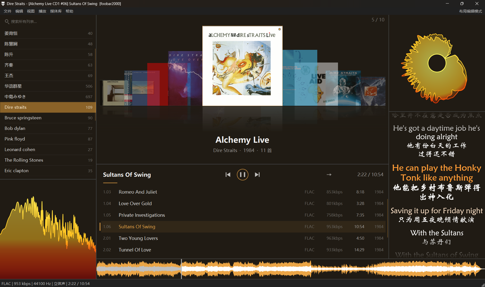

# Amber

**foobar2000 琥珀主题 / An amber-toned, coverflow-centric theme for foobar2000 v2 (x64)**

> 墙负责"看"，卡负责"读" —— 封面墙浏览 + 极简播放卡 + 全局琥珀暖色体系。
> 全部面板为原创 JSplitter 脚本，由 [ShixSun](https://github.com/ShixSun) 与 Claude 共同设计打造。

## 特性

- **封面墙**：伪 3D 轮播（倒影/缓动动画/高质量插值），滚轮翻页、双击播放，
  手动浏览后自动回到正在播放的专辑；**右键封面 = 原生菜单作用于整张专辑**
- **专辑播放卡**：正在播放歌名（点击一键回到该专辑）· 居中播放控制 · **顺序/循环/随机三键** ·
  走字时间；曲目行含 序号/标题/编码码率/时长/年份，**队列序号角标**，自动定位播放行；
  **曲目右键 = foobar2000 原生菜单**（移除/队列/标签/转换/属性…）
- **播放列表侧栏**：计数、琥珀高亮、**正在播放标记**、右键管理（新建/重命名/删除带确认）、
  **全局搜索结果面板**——检索所有列表、陈列全部匹配、点击跳转
- **联动协议**：面板间通过 `NotifyOthers("cf_album" / "amber_locate")` 通信，可自行扩展
- 配色跟随系统「颜色和字体」设置，琥珀点缀由脚本叠加——改一处底色全局换装

## 快速开始

见 [INSTALL.md](INSTALL.md)。核心三步：装 JSplitter → `amber\` 放进 profile → 导入 `theme.fth`。

## 定制

每个脚本头部都有「可调参数」区（字号/行高/动画速度/倒影高度…），
调色板集中在 [`amber/amber-lib.js`](amber/amber-lib.js)。

## License

[MIT](LICENSE) · 灵感致谢 [foobox](https://github.com/dream7180/foobox-cn)，运行时依赖 JSplitter（请从官方渠道获取）。

---

## English

**Amber** is an original, amber-toned theme for foobar2000 v2 (64-bit), built around a
pseudo-3D **coverflow** with reflections and eased animation, a minimal **album card**
(now-playing title, centered transport, playback-order toggle, live time, per-track
codec/bitrate info), and a **playlist sidebar** with global search that jumps straight
to the matched album. All panels are hand-written JSplitter scripts — no third-party
theme dependencies. Colors follow foobar2000's own "Colors and Fonts" settings
(suggested dark base `32,27,20` + highlight `235,165,70`), with amber accents layered
by the scripts. See [INSTALL.md](INSTALL.md) for setup. MIT licensed.
Designed by [ShixSun](https://github.com/ShixSun) & Claude, 2026.
